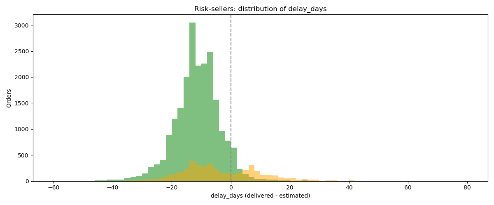
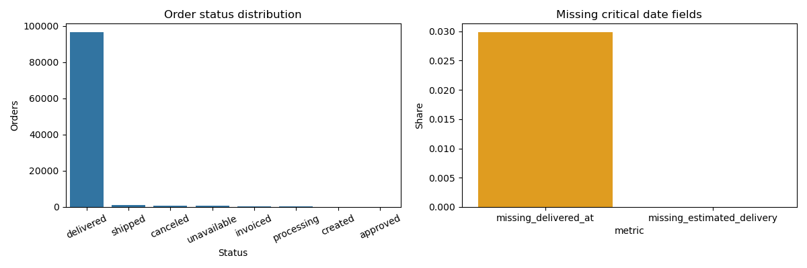
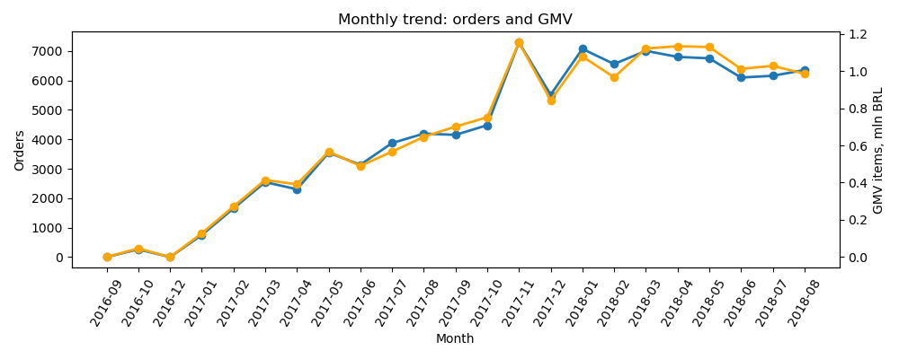
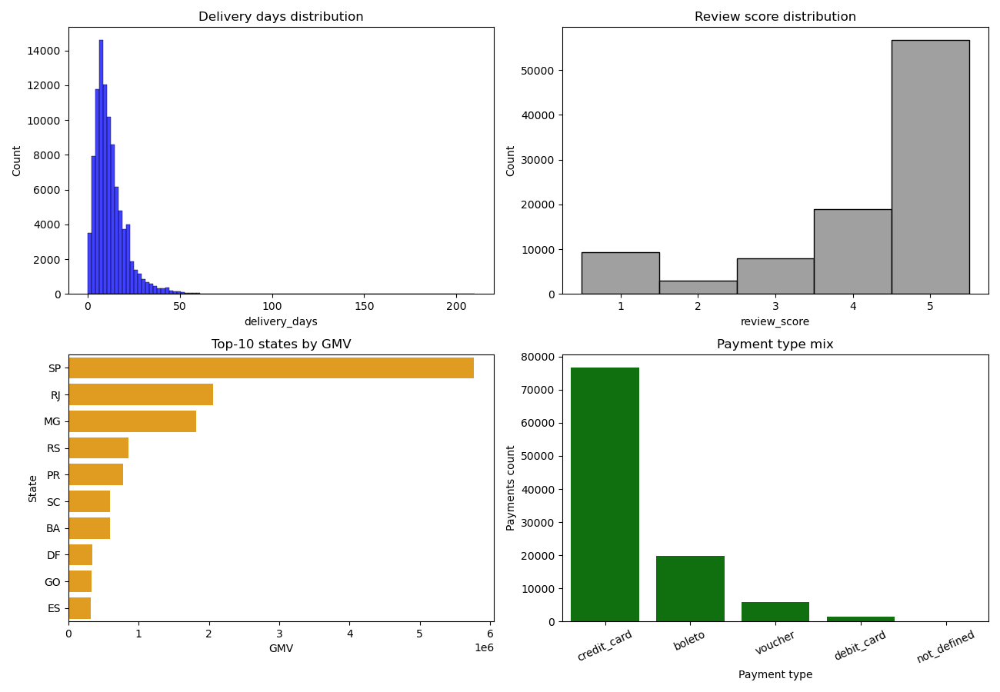
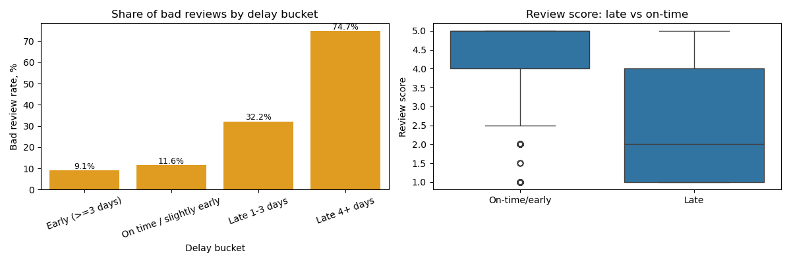
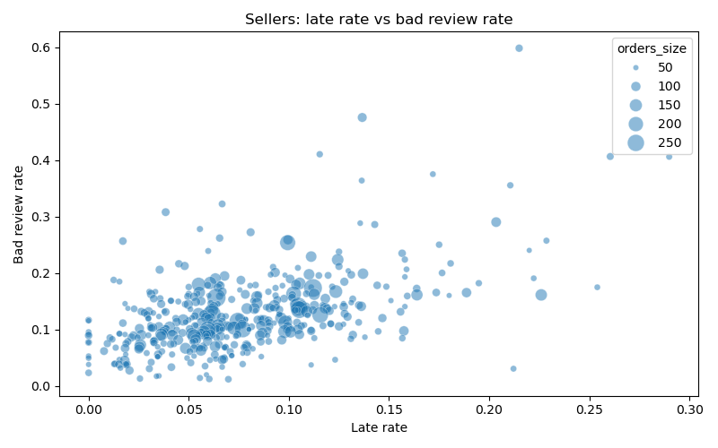
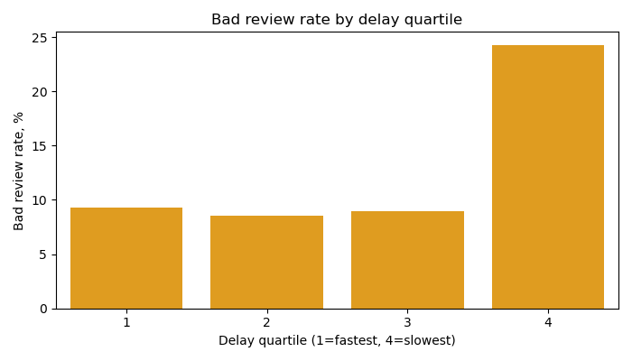
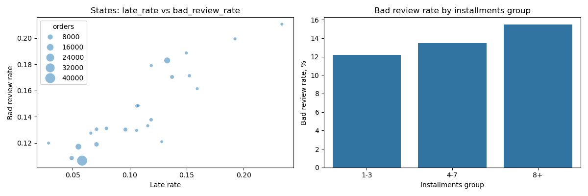

# Brazilian Commerce Analytics

Это демо-проект на датасете Olist.  
Бизнес-кейс: понять, почему часть заказов получает 1-2 звезды, и на какие зоны риска бизнесу смотреть в первую очередь. Кто виноват и что делать.

Источник данных: [Brazilian E-Commerce Public Dataset by Olist](https://www.kaggle.com/datasets/olistbr/brazilian-ecommerce).

## Состав репозитория

- `data/` - исходные CSV таблицы Olist.
- `requirements.txt` - список зависимостей.
- `artifacts` - сохраненные графики.
- `olist_case1_solution_report.ipynb` - основной ноутбук-решение по кейсу.

## Пайплайн:

- постановка бизнес-вопроса;
- сбор витрин в SQL (DuckDB);
- анализ качества данных;
- расчет метрик;
- визуализацию результатов;
- расчет мат-стат критерией;
- проверка гипотез;
- выводы.

### Рабочие гипотезы:
- задержки доставки увеличивают долю негативных отзывов;
- часть продавцов системно создает больше риска по сервису.
- есть группа продавцов, которая дает непропорционально много задержавшихся заказов с плохой оценкой.

### Ключевые метрики:

- Общая стоимость всех товаров;
- Средняя сумма, потраченная клиентом на заказ;
- `bad_review_rate` - доля заказов с `review_score <= 2`;
- `late_rate` - доля заказов, доставленных позже обещанного срока;
- `delay_days` / `delivery_days` - разница между фактической и обещанной датой доставки.

### Сбор базы данных (в репозитории не найдете, т.к. слишком большой размер):

#### Достаточно 5 таблиц:

- `olist_orders_dataset.csv` - даты и статус заказа
- `olist_order_items_dataset.csv` - цена и продавец 
- `olist_order_payments_dataset.csv` - тип оплаты и рассрочка (для проверки гипотез по финансовым инструментам)
- `olist_order_reviews_dataset.csv` - оценка клиента 
- `olist_customers_dataset.csv` - штат клиента (для проверки гипотез по регионам)

#### Базовые связи:
- `orders` -> `order_items`, `payments`, `reviews` по `order_id`;
- `orders` -> `customers` по `customer_id`.

### Базовая статистика:
- хи-квадрат для проверки независимости факта опоздания и низкой оценки.
- Спирман для проверки связи между ранговыми данными (оценки) и днями доставки.
- Манн-Уитни для прямого сравнения групп по дням доставки <=7 (быстрро) и >14 (долго).

### Что можем посмотреть визуально:

1. Динамика заказов и GMV по месяцам.
2. Распределение по дням доставки.
3. Доля плохих отзывов по группам задержки.
4. Scatter продавцов: `late_rate` vs `bad_review_rate`.
5. Распределение `review_score`.

## Выводы по анализу

Результаты по метрикам:
- доля плохих отзывов при late-доставке: 53.99%;
- доля плохих отзывов при on-time/early: 9.19%;
- эффект почти 5.9x в пользу гипотезы о влиянии просрочки (Odds Ratio ≈ 11.6);
- продавцов с более чем 50 заказами: 413, из них в risk-группе (по медиане): 114;
- хи^2, Spearman и Манн-Уитни подтверждают статистическую связь.

Общие выводы:
- логистика и уровень обслуживания напрямую связаны с клиентской оценкой.  
- начинать операционные улучшения стоит с risk-продавцов.

### Бимодальность delay_days у risk-продавцов

У ряда risk-продавцов средняя задержка отрицательная (доставляют раньше обещанного), хотя много отрихательных оценок
- Детальный анализ распределения `delay_days` (plot_08) показал двугорбую структуру:
- Основная масса заказов приходит сильно заранее — отсюда отрицательное среднее.
- Хвост из опаздывающих заказов почти целиком состоит из заказов с плохими отзывами.

Это значит, что для risk-продавцов проблема может быть не в системной просрочке, а в нестабильности логистики и качестве товара.

### Качество исходных данных

Базовая структура данных адекватна для анализа доставки и отзывов; при этом контроль пропусков обязателен до расчета метрик.

### Динамика заказов и GMV

Объем и деньги меняются вместе, значит сезонность и всплески спроса нужно учитывать при сравнении периодов.

### Обзор распределений и структуры

Рынок неоднороден по регионам и каналам оплаты, поэтому единый “средний” сценарий для всех сегментов не работает.

### Задержка и негатив

Доля плохих отзывов растет по мере ухудшения delay-бакета; boxplot показывает сдвиг оценок вниз у late-заказов. Проблема качества сервиса тесно связана со сроками доставки (очевидно, но мы проверили).

### Зоны риска по продавцам

Риск концентрирован, поэтому эффективнее работать точечно по риск-продавцам, а не пытаться менять всех сразу.

### Эффект по квартилям задержки

Имеется зависимость: чем дольше доставка тем хуже оценка.

### Дополнительные гипотезы (штаты и installments)

Регионы с высоким `late_rate` обычно имеют и более высокий `bad_review_rate`; также растет негатив в группе заказов с большим числом installments. Следующий слой анализа имеет смысл строить по региональным и платежным сегментам, а не только на агрегате по всей базе.

### Бимодальность delay_days у risk-продавцов

Распределение `delay_days` для risk-продавцов — двугорбое. Основная масса заказов приходит раньше срока, но хвост опаздывающих заказов почти целиком состоит из негативных отзывов. Проблема может быть в нестабильности логистики и качестве товара, а не в системной просрочке.

## Можно изучить дополнительные гипотезы и выводы из них

- `H4`: в штатах с более высоким `late_rate` выше `bad_review_rate`;
- `H5`: большее число платежей/рассрочка связано с более высоким риском негатива;

## Проверить взаимосвязь можем задизайнив эксперимент

- A/B-тест на risk-продавцах:
  - Выборка: только risk-продавцы (114 шт.).
  - Стратифицированная рандомизация.
  - test-группа: операционные меры (SLA-напоминания, быстрые эскалации, уведомления клиенту);
  - control-группа: без изменений;
  - главная метрика: доля опоздавших заказов с низкой оценкой;
  - срок: 6–8 недель.

## Инструкция по запуску

0. Создать папку data со скаченными таблицами датасета.
1. Создать окружение и установить зависимости:
   - `pip install -r requirements.txt`
2. Создать папку `data` в директории с ноутбуком. Скачать и разархивировать таблицы датасета Olist в папку.
3. Запустить Jupyter notebook:
   - `jupyter notebook` или через удобный вам IDE с установленными расширениями.
   - `olist_case1_solution_report.ipynb`

## Окружение

- Python 3
- Jupyter Notebook
- DuckDB
- pandas
- numpy
- matplotlib
- seaborn
- scipy
- sqlalchemy

